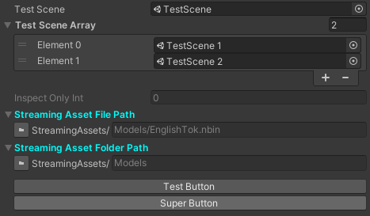

# Unity Utilities

This package is where all the utility functions as well as all the custom inspector drawer code lives.

- [Unity Utilities](#unity-utilities)
  - [Installation](#installation)
  - [Custom Propery Attribute](#custom-propery-attribute)
    - [A simple example:](#a-simple-example)
  - [Utilities](#utilities)
    - [A simple example for MathUtil:](#a-simple-example-for-mathutil)
    - [Under the hood:](#under-the-hood)
  - [Logging](#logging)
    - [A simple example:](#a-simple-example-1)
  - [Support the project!](#support-the-project)
  - [Join the community!](#join-the-community)
  - [License](#license)
  - [References](#references)
  - [Credits](#credits)

## Installation

This package depends on:
- com.unity.mathematics (Unity.Mathematics)
- com.unity.collections (Unity.Collections)

1. Install all dependencies from the Package Manager (only if it does not exists yet, you can check the `Packages` directory in Unity to double confirm).
2. Clone this repository into your project's Packages folder.
3. And you are ready to go!

## Custom Propery Attribute

### A simple example:
```cs
using UnityEngine;
using Voxell.Inspector;

public class CustomInspectorTest : MonoBehaviour
{
  [Scene]
  public string testScene;
  [Scene]
  public string[] testSceneArray;
  [InspectOnly]
  public int inspectOnlyInt;

  [StreamingAssetFilePath]
  public string streamingAssetFilePath;
  [StreamingAssetFolderPath]
  public string streamingAssetFolderPath;

  [Button]
  void TestButton() => Debug.Log("TestButton function invoked!");
  [Button("Super Button")]
  void AnotherTestButton() => Debug.Log("Button with Super Button name pressed!");
}
```



## Utilities

### A simple example for MathUtil:

```cs
using UnityEngine;
using Voxell.Mathx;

Vector3 vec1 = new Vector3(0.1f, 0.5f, 0.9f);
Vector3 vec2 = new Vector3(2.0, 0.1f, 1.0f);
Vector3 maxVec = VectorUtil.SingleOperation(vec1, vec2, Mathf.Max);

```
### Under the hood:

```cs
maxVec.x = Mathf.Max(vec1.x, vec2.x);
maxVec.y = Mathf.Max(vec1.y, vec2.y);
maxVec.z = Mathf.Max(vec1.z, vec2.z);
```

## Logging

### A simple example:
```cs
using UnityEngine;
using Voxell;

public class LoggingTest : MonoBehaviour
{
  public Logger logger;

  public void NormalLog() => logger.ConditionalLog("NormalLog", LogImportance.Info, LogType.Log);
  public void ImportantLog() => logger.ConditionalLog("ImportantLog", LogImportance.Important, LogType.Log);
  public void CrucialWarning() => logger.ConditionalLog("CrucialWarning", LogImportance.Crucial, LogType.Warning);
  public void CriticalError() => logger.ConditionalLog("CriticalError", LogImportance.Critical, LogType.Error);
}
```

## Support the project!

<a href="https://www.patreon.com/voxelltech" target="_blank">
  
</a>

<a href ="https://ko-fi.com/voxelltech" target="_blank">
  
</a>

## Join the community!

<a href ="https://discord.gg/WDBnuNH" target="_blank">
  
</a>


## License

This repository as a whole is licensed under the GNU Public License, Version 3. Individual files may have a different, but compatible license.

See [license file](./LICENSE) for details.

## References

- https://github.com/dbrizov/NaughtyAttributes

## Credits

Python Logo by [Jessica Williamson](https://www.behance.net/gallery/96750899/Python-Logo-Redesign):

<a href ="https://discord.gg/WDBnuNH" target="_blank">
  
</a>